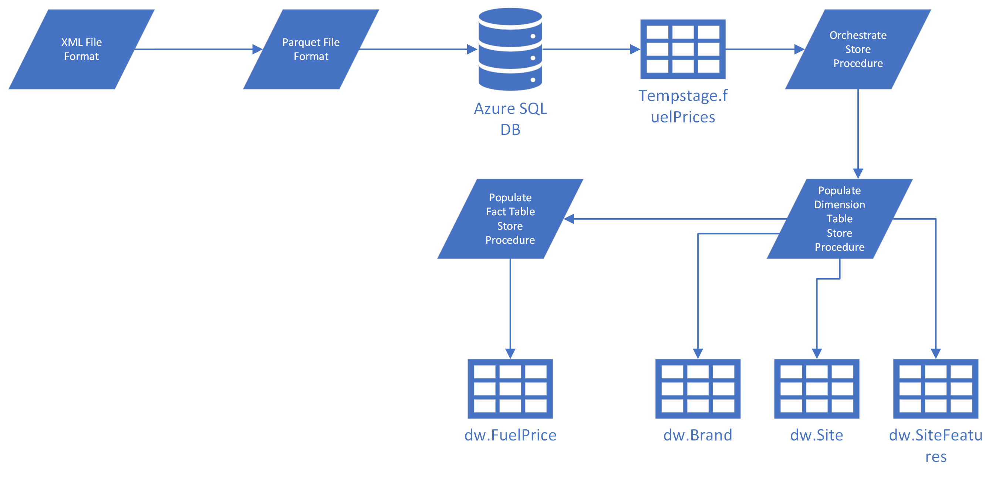
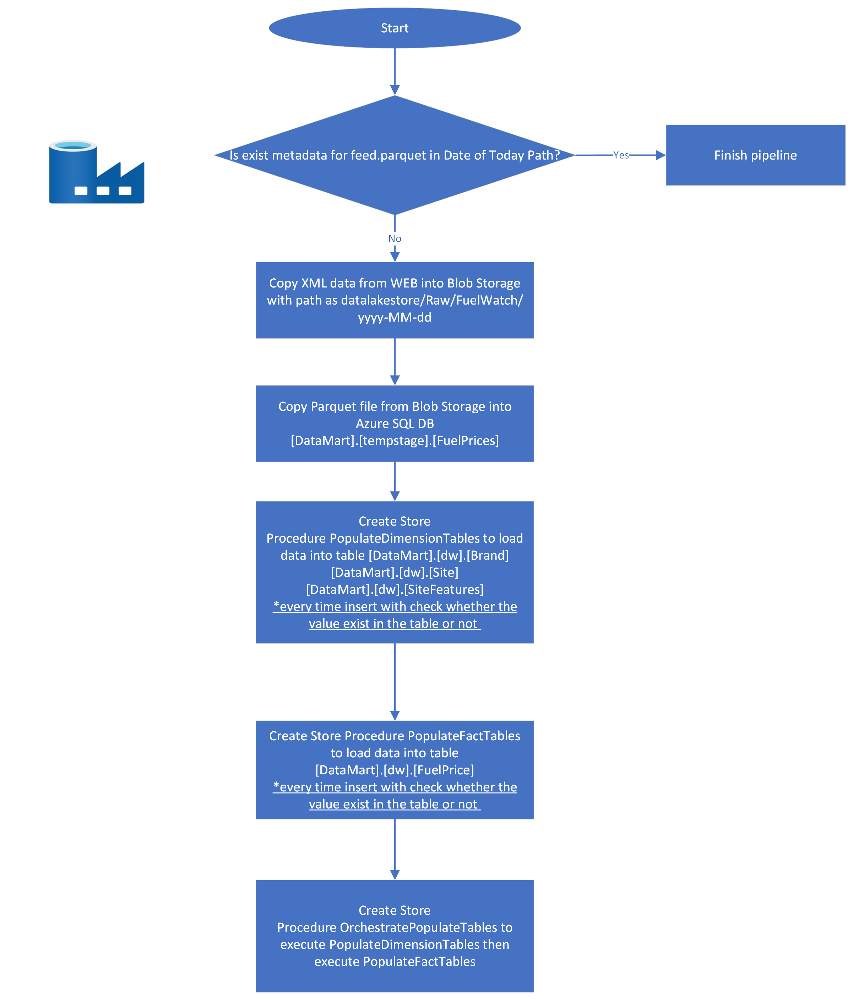

|Data Engineer|Dan HAI|
| :- | :- |
|Mode|Schedule|
|Pipeline name |pl\_fuelwatch\_au\_data\_load|
|Trigger name|tr\_fuelwatch\_price\_load|
|Original Source|XML|
|Frequency |Daily 9am SGT|
|Prod Start Date|2024-03-22|

[Fuel Watch Today Tableau Dashboard](https://public.tableau.com/app/profile/dan.hai8406/viz/FuelWatchProjectTableau/FuelWatchToday)

[Summary	1](#_toc122063744)

[High Level Data Architecture	1](#_toc1882525152)

[Logic Design/Flow	1](#_toc194808436)

[Table ER Diagram	2](#_toc1535665154)

[Test Case	3](#_toc1373887459)

[Azure Data Factory Design Diagram	4](#_toc1222277913)

[Azure SQL DB Design	5](#_toc143885388)

[Suggestion on CI/CD approach for the product development	6](#_toc757941834)

[Miscellaneous	6](#_toc930982026)

[Change Log	6](#_toc547309349)

# Summary
Pipeline aims to design a solution to extract current fuel prices from the Fuel Watch RSS feed. Refine the unstructured data, load it into a data lake, apply transformations, and construct a DB Datamart for utilization in Power BI.
# High Level Data Architecture

# Logic Design/Flow

# Table ER Diagram

# Test Case

|Test case|Result|Prove of evidence|
| :- | :- | :- |
|Is the pipeline integration well with Blob storage and Database?|pass|
Blob Storage

Azure SQL Database

|
|End to end testing|
pass

||
|Pipeline idempotent testing, executed multiple times without altering the final outcome|
pass

||

# Azure Data Factory Design Diagram
1\. Use metadata to check whether feed.parquet with Date of Today Path created or not.

2\. If not created, execute the design inside the false condition

3\. If the pipeline executes successfully, a success message will be sent to the email via Azure Logic App. If the pipeline execution fails, an alert email will also be sent.

# Azure SQL DB Design
**Schema**: [tempstage], [dw]

**Table**: 

[tempstage].[FuelPrices]

` `[dw].[Brand] 

[dw].[FuelPrice]

` `[dw].[Site]

` `[dw].[SiteFeatures]

# Miscellaneous
1. Pipeline alert can also set via Azure Monitor Alerts inside ADF
1. ADF pipeline can design as master pipeline and sub-pipeline, which make the advantage of creating 1 success alert email and creating 1 failure alert email instead of 4
1. As checking the data source is only provide on Western Australia area and web response data are follow with local time zone (UTC+8), so ADF pipeline to create blob storage folder follow the same time zone pattern.
   @concat('Raw/FuelWatch/', formatDateTime(convertTimeZone(utcnow(), 'UTC', 'AUS Eastern Standard Time'), 'yyyy-MM-dd'))
1. Azure DB connection set up control access by specifying which IP addresses are allowed to the database server

# Change Log (for future tracking the changes with Jira ticket)

|Jira #|Description|Data Engineer|Prod Release Date|
| :- | :- | :- | :- |
|||||

